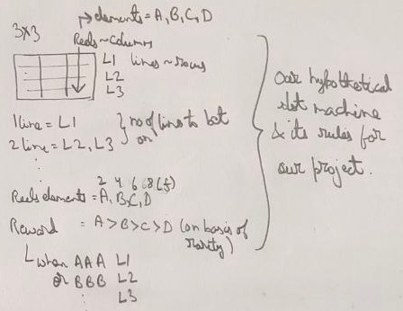

# Text based slot machine

Goal: Learn python with one project >> different aspects of python
 
### Understanding the Project and its wokring

1. User deposits a certain amount of money
2. User bet on 1 2 3 lines of slot machine >> straight lines
3. If they got any line >> multiply the bet bu the value of that line and add that to their balance
4. Allow them to play until they run out of money or cashout

 
 

### Dividing project into required tasks >> QDD
1. Collect user deposit
2. Add that to their balance
3. Allow them to bet on one or multiple lines
4. Generate items on reels 
5. Spin those lines/reels
6. Check if they got any of those lines
7. Add whatever they won back to the balance

